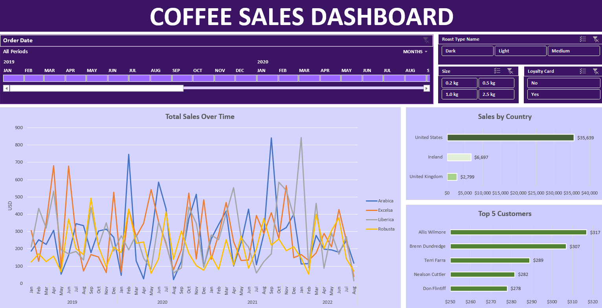

## **Completed Dashboard for the Project:**

## Methods/Functions Performed During Analysis:
- XLOOKUP & INDEX MATCH to join sales table with other dimension ones (customer, product,...)
- Pivot table and Pivot chart for data manipulation (grouping, aggregation, filtering,...)
- Perform `RFM Analysis (Recency - Frequency - Monetary)` Model using PERCENTRANK.EXC function, sort out most potential/loyal customers who possesses top scores for all values